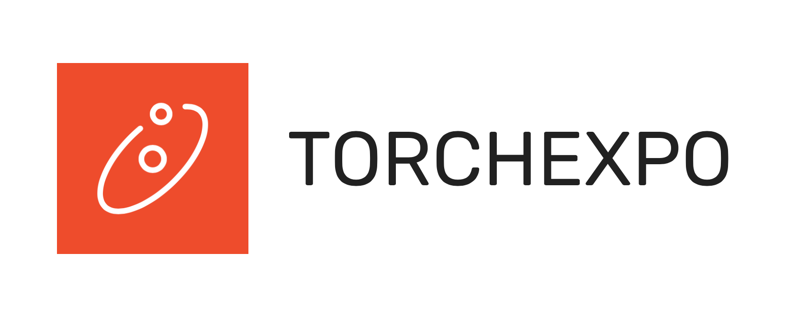
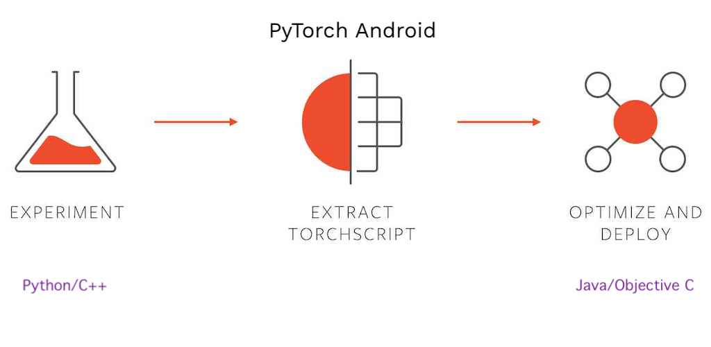

<h1 align="center">
 
</h1>
<p align="center">
 Android application running models from TorchExpo
 <br />
 <br />
 
 
 
</p>

* [About PyTorch Mobile](#about-pytorch-mobile)
* [Getting Started](#getting-started)
  * [Prerequisites](#prerequisites)
  * [Installation](#installation)
* [Contributing](#contributing)
* [License](#license)

## About PyTorch Mobile
PyTorch Mobile is an experiment release that provides APIs to build an end-to-end workflow
from Python to deployment on iOS and Android. _[Read more](https://pytorch.org/mobile/home/)_

<p align="center">
	
</p>

### PyTorch Android API
PyTorch Mobile provides Java APIs for integration of Machine Learning models built with Python
into an Android application. It is as simple as importing and using any other Android library. You
can add PyTorch's Gradle dependencies and can run inferences.
_[Read more](https://pytorch.org/mobile/android/)_

### Built With
* [PyTorch](https://pytorch.org)
* [PyTorch Android API](https://pytorch.org/mobile/android/)
* [Android Ecosystem](https://developer.android.com)

## Getting Started

### Prerequisites
* [Kotlin](https://kotlinlang.org)
* [Android Studio](https://developer.android.com/studio)

### Installation
* Git clone this/forked repository
```shell script
git clone https://github.com/torchexpo/android.git
OR
git clone https://github.com/<YOUR_GITHUB_USERNAME>/TorchExpo.git
```

## Contributing
We appreciate all contributions. If you are planning to contribute back bug-fixes, please do so
without any further discussion.

If you plan to contribute new features, utility functions or any application upgrades, please first
open an issue and discuss the feature with us. Sending a PR without discussion might end up
resulting in a rejected PR, because we might be taking the project in a different direction
than you might be aware of.

Please refer our [Contribution Guide](CONTRIBUTING.md) for more details.

## License
This project is licensed under Apache-2.0 as given in [LICENSE](LICENSE) file.